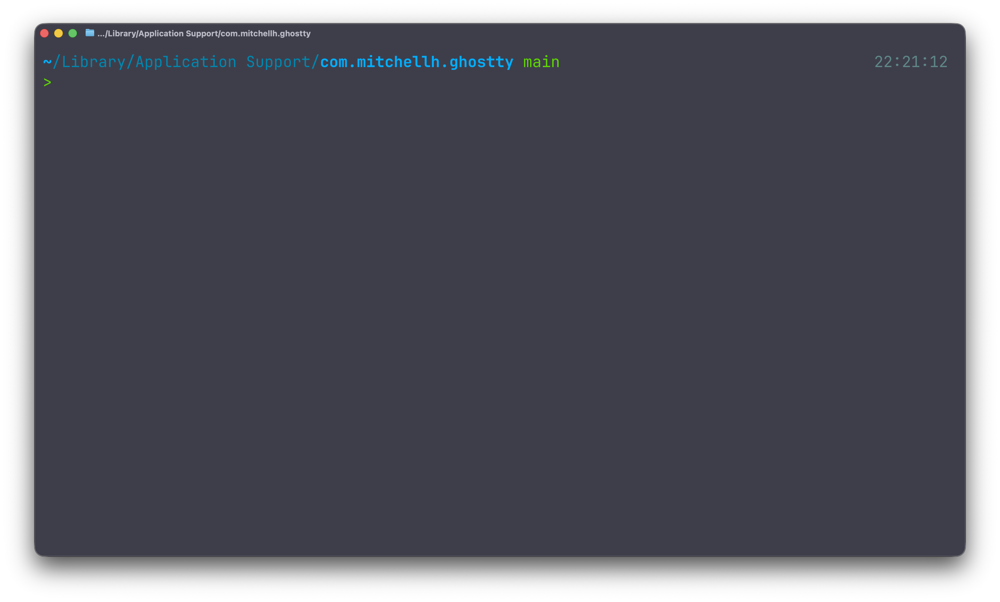
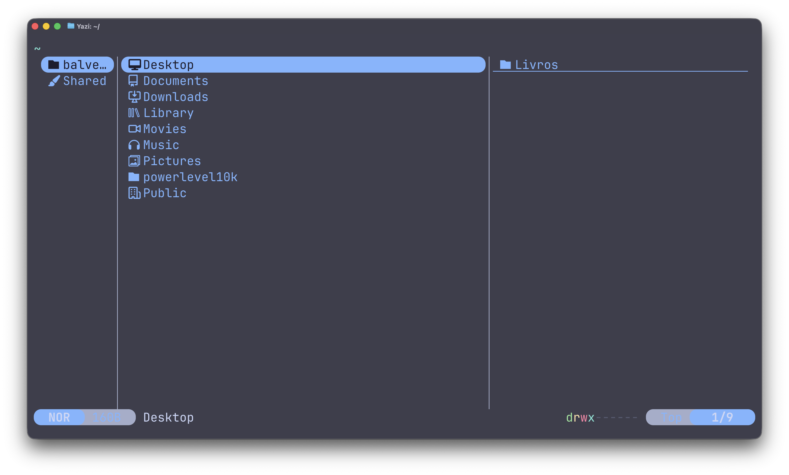
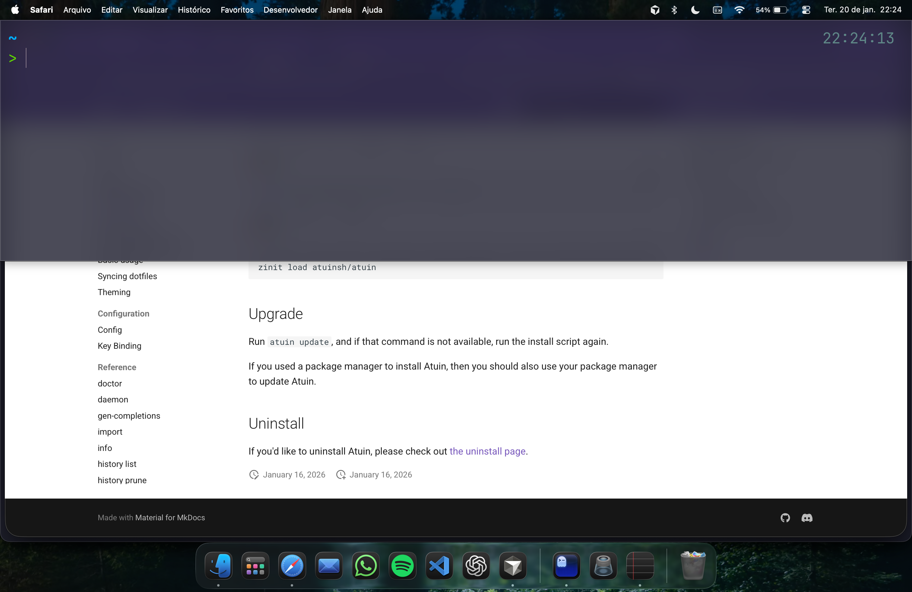
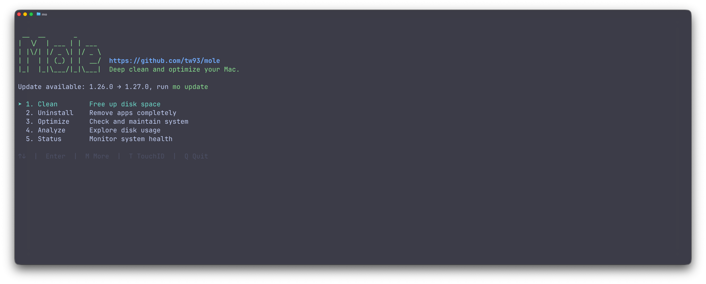

# Ghostty Terminal Configuration

This repository contains my custom configuration for the [Ghostty](https://github.com/ghostty-org/ghostty) terminal, including integration with [Atuin](https://github.com/atuinsh/atuin) for command history, [Yazi](https://github.com/sxyazi/yazi) as a file manager, and [Mole](https://github.com/tw93/mole) for Mac cleaning and optimization.

## Preview



### Ghostty Terminal in Action

The terminal configured with the Catppuccin Mocha theme, JetBrains Mono Nerd Font, and transparency/blur for a modern look.

### Atuin - Smart Command History


Atuin lets you search and navigate through command history efficiently, with semantic search and execution statistics.

### Yazi - File Manager



Yazi offers a modern file browsing experience directly in the terminal, with preview and intuitive navigation.

### Mole - Mac Cleaning and Optimization

[Mole](https://github.com/tw93/mole) is a CLI tool to deep clean and optimize your Mac, featuring system cleanup, smart app uninstalling, disk space analysis, live system monitoring, and project artifact cleanup.

### Dropdown Terminal (Cmd+Esc)



Global shortcut `Cmd+Esc` to quickly open/close the terminal from any application.

## Installation

### Prerequisites

- macOS (tested on macOS Sonoma/Ventura)
- Homebrew installed
- Git installed

### 1. Install Ghostty

```bash
brew install --cask ghostty
```

### 2. Install Zsh and Oh My Zsh

#### Install Zsh

Zsh usually comes pre-installed on macOS. To verify:

```bash
zsh --version
```

If it's not installed or you want to update:

```bash
brew install zsh
```

#### Install Oh My Zsh

```bash
sh -c "$(curl -fsSL https://raw.githubusercontent.com/ohmyzsh/ohmyzsh/master/tools/install.sh)"
```

### 3. Install Powerlevel10k (Theme)

```bash
git clone --depth=1 https://github.com/romkatv/powerlevel10k.git ${ZSH_CUSTOM:-$HOME/.oh-my-zsh/custom}/themes/powerlevel10k
```

Then add to your `~/.zshrc`:

```zsh
source /opt/homebrew/share/powerlevel10k/powerlevel10k.zsh-theme
```

### 4. Install Zsh Plugins

#### zsh-syntax-highlighting

```bash
git clone https://github.com/zsh-users/zsh-syntax-highlighting.git ${ZSH_CUSTOM:-~/.oh-my-zsh/custom}/plugins/zsh-syntax-highlighting
```

#### zsh-autosuggestions

```bash
git clone https://github.com/zsh-users/zsh-autosuggestions ${ZSH_CUSTOM:-~/.oh-my-zsh/custom}/plugins/zsh-autosuggestions
```

#### zsh-history-substring-search

```bash
git clone https://github.com/zsh-users/zsh-history-substring-search ${ZSH_CUSTOM:-~/.oh-my-zsh/custom}/plugins/zsh-history-substring-search
```

#### Other plugins

The `z`, `sudo`, `web-search`, and `copypath` plugins are already included with Oh My Zsh.

### 5. Configure .zshrc

Copy the contents of the provided `.zshrc` file or add the following configuration:

```zsh
plugins=(
  z
  sudo
  zsh-syntax-highlighting
  web-search
  copypath
  zsh-autosuggestions
  zsh-history-substring-search
)

export ZSH="$HOME/.oh-my-zsh"
source $ZSH/oh-my-zsh.sh
source /opt/homebrew/share/powerlevel10k/powerlevel10k.zsh-theme

# Bind keyboard shortcuts for zsh-history-substring-search
bindkey "$terminfo[kcuu1]" history-substring-search-up
bindkey "$terminfo[kcud1]" history-substring-search-down
```

### 6. Install and Configure Atuin

#### Installation

```bash
brew install atuin
```

It can also be installed with the following command, as described in the [Atuin documentation](https://docs.atuin.sh/cli/guide/installation/#__tabbed_1_2):
```bash
curl --proto '=https' --tlsv1.2 -LsSf https://setup.atuin.sh | sh
```


#### .zshrc Configuration

Add to the end of your `~/.zshrc`:

```zsh
. "$HOME/.atuin/bin/env"
eval "$(atuin init zsh)"
```

#### Sync (Optional)

To sync your history across devices:

```bash
atuin register -u <your-username>
atuin login -u <your-username>
```

And to sync your history with previously executed commands:

```bash
atuin import auto
```

### 7. Install and Configure Yazi

#### Installation

**1. Update brew:**

```bash
brew update
```

**2. Install dependencies:**
```bash
brew install yazi ffmpeg sevenzip jq poppler fd ripgrep fzf zoxide resvg imagemagick font-symbols-only-nerd-font
```

**3. Install Yazi:**
```bash
brew install yazi
```

#### Custom Function in .zshrc

Add this function to your `~/.zshrc` to allow Yazi to change the current directory after closing:

```zsh
function y() {
	local tmp="$(mktemp -t "yazi-cwd.XXXXXX")"
	yazi "$@" --cwd-file="$tmp"
	if cwd="$(cat "$tmp")" && [ -n "$cwd" ] && [ "$cwd" != "$PWD" ]; then
		builtin cd -- "$cwd"
	fi
	rm -f "$tmp"
}
```

**How it works:**
- Creates a temporary file to store the current directory
- Opens Yazi with the temporary file as a reference
- When you close Yazi, it saves the selected directory to the temporary file
- The function reads that file and changes to the selected directory
- Removes the temporary file after use

**Usage:**
```bash
y          # Opens Yazi in the current directory
y /path    # Opens Yazi in a specific directory
```

### 8. Install Mole



[Mole](https://github.com/tw93/mole) is a CLI tool for deep cleaning and optimizing your Mac.


```bash
brew install mole
```

It can also be installed via the install script:

```bash
curl -fsSL https://raw.githubusercontent.com/tw93/mole/main/install.sh | bash
```

**Key features:**
- Deep system cleanup (caches, logs, browser data)
- Smart app uninstaller with thorough removal of associated files
- System optimization (rebuilds databases, clears caches, refreshes services)
- Disk space analysis and large file identification
- Live system monitoring (CPU, memory, disk, network)
- Project artifact cleanup (node_modules, target, venv, etc.)

**Usage:**

```bash
mole
```

### 9. Configure Ghostty

Copy the `config` file to the Ghostty configuration directory:

```bash
mkdir -p "$HOME/Library/Application Support/com.mitchellh.ghostty"
cp config "$HOME/Library/Application Support/com.mitchellh.ghostty/config"
```

Or clone this repository and create a symlink:

```bash
git clone <your-repository> ~/.config/ghostty
ln -s ~/.config/ghostty/config "$HOME/Library/Application Support/com.mitchellh.ghostty/config"
```

### 10. Install Nerd Fonts

The theme requires a Nerd Font. Install [JetBrains Mono Nerd Font](https://formulae.brew.sh/cask/font-jetbrains-mono-nerd-font):

```bash
brew install --cask font-jetbrains-mono-nerd-font
```

## Keyboard Shortcuts

### Ghostty Global Shortcuts

| Shortcut | Action |
|----------|--------|
| `Cmd + Esc` | Opens/closes the dropdown terminal (quick terminal) |

### Ghostty Terminal Shortcuts

#### Split Screen (Splits)

| Shortcut | Action |
|----------|--------|
| `Super + D` | Creates a vertical split (right) |
| `Super + Shift + D` | Creates a horizontal split (bottom) |
| `Super + Ctrl + H` | Moves to the left split |
| `Super + Ctrl + L` | Moves to the right split |
| `Super + Ctrl + K` | Moves to the split above |
| `Super + Ctrl + J` | Moves to the split below |

#### Tab Management

| Shortcut | Action |
|----------|--------|
| `Super + T` | Creates a new tab |
| `Super + W` | Closes the current surface (split/tab) |
| `Super + Alt + Right Arrow` | Next tab |
| `Super + Alt + Left Arrow` | Previous tab |

#### Utilities

| Shortcut | Action |
|----------|--------|
| `Super + R` | Reloads the configuration |
| `Super + Ctrl + F` | Toggles fullscreen |

**Note:** `Super` refers to the `Cmd` key on macOS.

### Zsh Shortcuts (History)

| Shortcut | Action |
|----------|--------|
| `Up Arrow` | Search history (substring search) |
| `Down Arrow` | Reverse history search |

### Atuin Shortcuts

| Shortcut | Action |
|----------|--------|
| `Ctrl + R` | Opens Atuin for history search |
| `Esc` | Closes Atuin |
| `Tab` | Edits the selected command |
| `Enter` | Executes the selected command |
| `Ctrl + O` | Inspects the history |

## macOS Update Script

The repository includes a useful script to update the system and Homebrew packages.

### Script Installation

1. Make sure the script is executable:

```bash
chmod +x /Users/balvesdematos/Documents/script/update_mac.sh
```

2. The alias is already configured in `.zshrc`:

```zsh
alias update="/Users/balvesdematos/Documents/script/update_mac.sh"
```

### Usage

Simply run:

```bash
update
```

The script will:
- Check for Homebrew updates
- Check for macOS updates
- Ask if you want to install the updates
- Run the updates according to your choice

## Customization

### Theme

The current theme is **Catppuccin Mocha**. To change it, edit the following line in the `config` file:

```ini
theme = Catppuccin Mocha
```

Other available themes can be found in the [Ghostty documentation](https://ghostty.org/docs/themes).

### Font

The default font is **JetBrains Mono Nerd Font**. To change it:

```ini
font-family = "Your Nerd Font"
font-size = 25
```

### Transparency and Blur

Adjust opacity and blur in the `config` file:

```ini
background-opacity = 0.8  # 0.0 (transparent) to 1.0 (opaque)
background-blur = 90       # Blur intensity
```

## Troubleshooting

### The terminal doesn't open with Cmd+Esc

Make sure Ghostty has accessibility permissions:
1. Go to **System Settings > Privacy & Security > Accessibility**
2. Add Ghostty to the list of allowed applications

### Atuin is not working

Check that Atuin is installed and initialized:

```bash
atuin --version
atuin info
```

If necessary, reinitialize the shell:

```bash
exec zsh
```

### Yazi doesn't change the directory

Make sure the `y()` function is in your `.zshrc` and that you're using `y` instead of `yazi` directly.

### Zsh plugins aren't working

Check that the plugins are installed in the correct directories:

```bash
ls ~/.oh-my-zsh/custom/plugins/
```

And make sure they're listed in the `plugins` array in `.zshrc`.

## Additional Resources

- [Ghostty Documentation](https://ghostty.org/docs)
- [Atuin Documentation](https://docs.atuin.sh/cli/guide/import/)
- [Yazi Documentation](https://yazi-rs.github.io/docs/installation)
- [Mole](https://github.com/tw93/mole)
- [Oh My Zsh](https://ohmyz.sh/)
- [Powerlevel10k](https://github.com/romkatv/powerlevel10k)

## License

This repository contains only personal configurations. Feel free to use and adapt them to your needs.

## Contributing

Suggestions and improvements are welcome! Feel free to open an issue or pull request.
